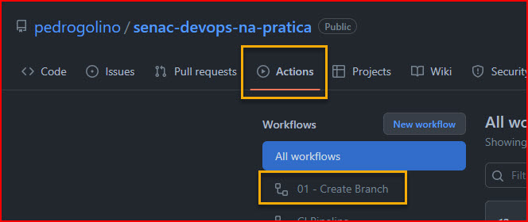
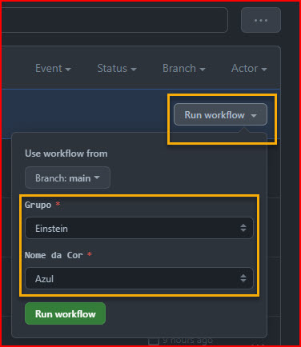
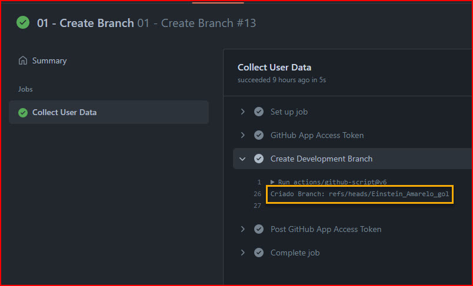

# Sala Philips - DevOps na Prática - Lab 🧪

## Criação de Workflows ♾️
Neste Lab faremos passoa a passo a criação de um novo _workflow_ para uso no repositório.

---

 - [Instruções](#instruções)
   - [1 - Criar um novo Branch](#1-criar-um-novo-branch-🧬)
   - [2 - Adicionar um novo arquivo de Workflow](#2---adicionar-um-novo-arquivo-de-workflow-)
   - [3 - Criação do Workflow](#3---criação-do-workflow)

---
## Instruções
### 1 Criar um novo Branch 🧬

- Para criar um novo branch, utilize a automação [01 - Create branch](https://github.com/pedrogolino/senac-devops-na-pratica/actions/workflows/01_create_branch.yml)

    

- Escolha o seu __Grupo__ e __Cor__ conforme instrução.

    

- Clique em `Run workflow`

    

- Verifique o resutado no passo `Create Development Branch`
    ```
    Criado Branch: refs/heads/<Grupo>_<Cor>_<Iniciais_da_conta>
    ```
    

### 2 - Adicionar um novo arquivo de _workflow_ 📝

### 3 - Criação do _Workflow_
- Criar estrutura do _workflow_
- Definição do _workflow_
- Step `checkout`
- Step `npm install`
- Step `npm build` 🔨